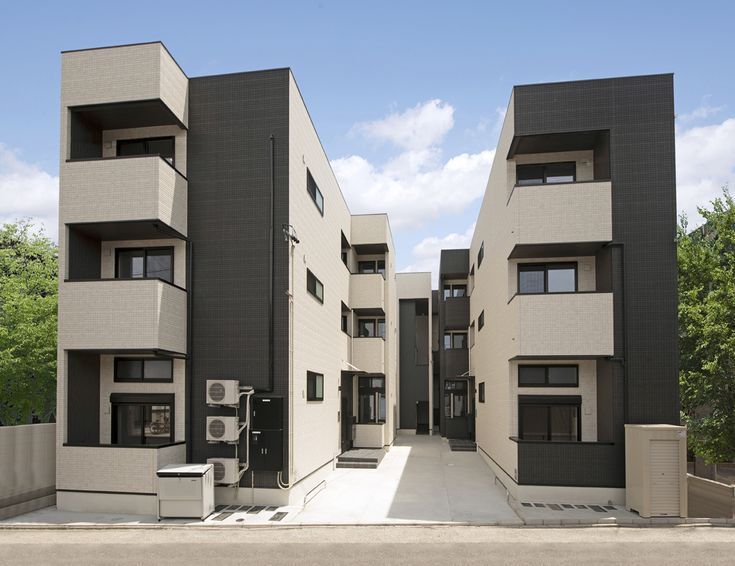

# KostQ - Sistem Manajemen Kost

KostQ adalah platform manajemen kost online yang memungkinkan penyewa untuk mencari dan memesan kamar kost, serta admin untuk mengelola properti, booking, dan pembayaran. Sistem ini dibangun menggunakan PHP dan MySQL dengan memanfaatkan stored procedure, trigger, transaction, dan stored function untuk memastikan integritas data dan keamanan transaksi.



## 📌 Deskripsi Proyek

KostQ memiliki fitur-fitur utama sebagai berikut:

- **Manajemen Kamar**: Admin dapat menambah, mengedit, dan menghapus kamar kost dengan fasilitas lengkap
- **Sistem Booking**: Penyewa dapat melakukan booking kamar dengan berbagai durasi sewa
- **Manajemen Pembayaran**: Sistem pembayaran dengan upload bukti transfer dan verifikasi admin
- **Dashboard Multi-Role**: Dashboard khusus untuk penyewa dan admin dengan fitur yang berbeda
- **Laporan & Analytics**: Sistem pelaporan komprehensif untuk monitoring bisnis

Sistem ini mengimplementasikan konsep database lanjutan untuk memastikan keamanan dan integritas data dalam proses manajemen kost.

## 📊 Detail Implementasi

### 🧠 Stored Procedure

Stored procedure digunakan untuk mengenkapsulasi logika bisnis kompleks di sisi database, memastikan konsistensi dan keamanan operasi.

#### 1. `BookRoom` - Prosedur untuk booking kamar

**Implementasi di file**: `booking.php`

```php
// Panggil stored procedure untuk booking
$booking_query = "CALL BookRoom(?, ?, ?, ?, @booking_id, @status)";
$booking_stmt = $db->prepare($booking_query);
$booking_stmt->execute([$user_id, $room_id, $start_date, $duration_months]);

// Ambil hasil dari procedure
$result_query = "SELECT @booking_id as booking_id, @status as status";
$result_stmt = $db->prepare($result_query);
$result_stmt->execute();
$result = $result_stmt->fetch(PDO::FETCH_ASSOC);

if (strpos($result['status'], 'SUCCESS') !== false) {
    $success = "Booking berhasil dibuat!";
    $booking_id = $result['booking_id'];
} else {
    $error = $result['status'];
}

```

Prosedur ini menangani validasi ketersediaan kamar, perhitungan total biaya, pembuatan booking, dan pembuatan record pembayaran secara atomik.

#### 2. `ApproveBooking` - Prosedur untuk approve booking

**Implementasi di file**: `admin/bookings.php`

```php
try {
    // Gunakan stored procedure untuk approval
    $stmt = $db->prepare("CALL ApproveBooking(?, ?, @status)");
    $stmt->bindParam(1, $booking_id, PDO::PARAM_INT);
    $stmt->bindParam(2, $admin_id, PDO::PARAM_INT);
    $stmt->execute();
    
    // Ambil hasil
    $result_stmt = $db->query("SELECT @status as status");
    $result = $result_stmt->fetch(PDO::FETCH_ASSOC);
    
    if (strpos($result['status'], 'SUCCESS') !== false) {
        $success = "Booking berhasil diapprove!";
    } else {
        $error = "Gagal approve booking: " . $result['status'];
    }
} catch (PDOException $e) {
    $error = "Terjadi kesalahan saat approve booking.";
}
```

Prosedur ini menangani proses approval booking, update status kamar menjadi occupied, dan logging aktivitas admin.

#### 3. `CalculateMonthlyRevenue` - Prosedur untuk menghitung pendapatan bulanan

**Implementasi di file**: `admin/reports.php`

```php
// Hitung revenue bulanan menggunakan stored procedure
$revenue_query = "CALL CalculateMonthlyRevenue(?, ?, @revenue, @bookings, @avg_value, @status)";
$stmt = $db->prepare($revenue_query);
$stmt->execute([date('Y'), date('n')]);

// Ambil hasil
$result_query = "SELECT @revenue as revenue, @bookings as bookings, @avg_value as avg_value";
$stmt = $db->prepare($result_query);
$stmt->execute();
$revenue_data = $stmt->fetch(PDO::FETCH_ASSOC);

echo "Revenue Bulan Ini: Rp " . number_format($revenue_data['revenue'], 0, ',', '.');
```

Prosedur ini menghitung total pendapatan, jumlah booking, dan rata-rata nilai booking untuk periode tertentu.

### 🚨 Trigger

Trigger adalah kode yang dijalankan secara otomatis di database ketika terjadi operasi tertentu (INSERT, UPDATE, DELETE) pada tabel. Dalam sistem KostQ, trigger diimplementasikan untuk menjaga konsistensi data dan otomatisasi proses bisnis.

#### Implementasi Trigger di Database

1. **Trigger untuk Auto-Update Room Status**


```sql
DELIMITER //
CREATE TRIGGER booking_status_update 
AFTER UPDATE ON bookings
FOR EACH ROW
BEGIN
    IF NEW.status = 'approved' AND OLD.status = 'pending' THEN
        UPDATE rooms SET status = 'occupied' WHERE id = NEW.room_id;
        
        INSERT INTO activity_logs (user_id, action, description)
        VALUES (NEW.user_id, 'BOOKING_APPROVED', CONCAT('Booking approved for room: ', NEW.room_id));
    END IF;
    
    IF NEW.status = 'completed' AND OLD.status = 'active' THEN
        UPDATE rooms SET status = 'available' WHERE id = NEW.room_id;
        
        INSERT INTO activity_logs (user_id, action, description)
        VALUES (NEW.user_id, 'BOOKING_COMPLETED', CONCAT('Booking completed for room: ', NEW.room_id));
    END IF;
END //
DELIMITER ;
```

2. **Trigger untuk Auto-Generate Payment Record**


```sql
DELIMITER //
CREATE TRIGGER auto_payment_record 
AFTER UPDATE ON bookings
FOR EACH ROW
BEGIN
    IF NEW.status = 'approved' AND OLD.status = 'pending' THEN
        INSERT INTO payments (booking_id, amount, payment_date, payment_method, status)
        VALUES (NEW.id, NEW.total_amount, CURDATE(), 'transfer', 'pending');
    END IF;
END //
DELIMITER ;
```

#### Bukti Penggunaan Trigger dalam Aplikasi

**Di file `admin/bookings.php`**:

```php
// Ketika admin approve booking, trigger otomatis akan:
// 1. Update status kamar menjadi 'occupied'
// 2. Create payment record
// 3. Log aktivitas ke activity_logs

$update_query = "UPDATE bookings SET status = 'approved' WHERE id = ?";
$update_stmt = $db->prepare($update_query);
$update_stmt->execute([$booking_id]);

// Trigger akan berjalan otomatis setelah UPDATE ini
```

**Di file `scripts/advanced_task_scheduler.php`**:

```php
// Proses expired bookings - trigger akan otomatis update room status
$update_query = "UPDATE bookings SET status = 'completed' WHERE id = ?";
$update_stmt = $db->prepare($update_query);
$update_stmt->execute([$booking['id']]);

// Trigger 'booking_status_update' akan otomatis:
// - Set room status ke 'available'
// - Log aktivitas completion
```

### 🔄 Transaction

Transaction memastikan bahwa serangkaian operasi database berjalan sebagai satu kesatuan yang utuh. Jika satu operasi gagal, semua operasi dibatalkan.

#### 1. Transaction untuk Proses Booking

**Implementasi di file**: `booking.php`

```php
try {
    $db->beginTransaction();
    
    // Calculate end date
    $end_date = date('Y-m-d', strtotime($start_date . ' + ' . $duration . ' months'));
    $total_amount = $room['price'] * $duration;
    
    // Create booking
    $booking_query = "INSERT INTO bookings (user_id, room_id, start_date, end_date, duration_months, total_amount, status, booking_date) 
                     VALUES (?, ?, ?, ?, ?, ?, 'pending', CURDATE())";
    $booking_stmt = $db->prepare($booking_query);
    $booking_stmt->execute([$user_id, $room_id, $start_date, $end_date, $duration, $total_amount]);
    
    $booking_id = $db->lastInsertId();
    
    // Create payment record
    $payment_query = "INSERT INTO payments (booking_id, amount, payment_date, payment_method, status) 
                     VALUES (?, ?, CURDATE(), ?, ?)";
    $payment_stmt = $db->prepare($payment_query);
    $payment_stmt->execute([$booking_id, $total_amount, $payment_method, $payment_status]);
    
    // Update room status
    $room_update = "UPDATE rooms SET status = 'booked' WHERE id = ?";
    $room_stmt = $db->prepare($room_update);
    $room_stmt->execute([$room_id]);
    
    $db->commit();
    $success = "Booking berhasil dibuat!";
    
} catch (PDOException $e) {
    $db->rollback();
    $error = "Terjadi kesalahan sistem. Silakan coba lagi.";
}
```

Transaction ini memastikan bahwa pembuatan booking, payment record, dan update status kamar berjalan sebagai satu kesatuan.

#### 2. Transaction untuk Payment Verification

**Implementasi di file**: `admin/payments.php`

```php
try {
    $db->beginTransaction();
    
    // Update payment status
    $update_query = "UPDATE payments SET status = 'completed', verified_by = ?, verified_at = NOW() WHERE id = ?";
    $update_stmt = $db->prepare($update_query);
    $update_stmt->execute([$admin_id, $payment_id]);
    
    // Get booking info dan update booking status
    $booking_query = "SELECT b.*, r.room_id FROM payments p 
                     JOIN bookings b ON p.booking_id = b.id 
                     WHERE p.id = ?";
    $booking_stmt = $db->prepare($booking_query);
    $booking_stmt->execute([$payment_id]);
    $booking = $booking_stmt->fetch(PDO::FETCH_ASSOC);
    
    if ($booking) {
        // Update booking status to active
        $booking_update = "UPDATE bookings SET status = 'active' WHERE id = ?";
        $booking_stmt = $db->prepare($booking_update);
        $booking_stmt->execute([$booking['id']]);
        
        // Update room status to occupied
        $room_update = "UPDATE rooms SET status = 'occupied' WHERE id = ?";
        $room_stmt = $db->prepare($room_update);
        $room_stmt->execute([$booking['room_id']]);
    }
    
    // Log activity
    $log_query = "INSERT INTO activity_logs (user_id, action, description, ip_address) 
                 VALUES (?, 'APPROVE_PAYMENT', ?, ?)";
    $log_stmt = $db->prepare($log_query);
    $log_stmt->execute([$admin_id, "Approved payment ID: {$payment_id}", $_SERVER['REMOTE_ADDR']]);
    
    $db->commit();
    $success = "Pembayaran berhasil diverifikasi!";
} catch (PDOException $e) {
    $db->rollBack();
    $error = "Terjadi kesalahan saat memverifikasi pembayaran.";
}
```

### 📊 Stored Function

Stored function digunakan untuk mengembalikan nilai berdasarkan perhitungan atau query tertentu.

#### 1. `GetTotalRevenue` - Fungsi untuk menghitung total pendapatan

**Implementasi di file**: `admin/dashboard.php`

```php
// Hitung total revenue menggunakan stored function
$revenue_query = "SELECT GetTotalRevenue(?, ?) as total_revenue";
$stmt = $db->prepare($revenue_query);
$stmt->execute([date('Y-m-01'), date('Y-m-t')]);
$revenue_result = $stmt->fetch(PDO::FETCH_ASSOC);

$monthly_revenue = $revenue_result['total_revenue'];
```

```php
<div class="card stats-card">
    <div class="card-body text-center">
        <i class="fas fa-money-bill-wave fa-3x mb-3 text-success"></i>
        <h3>Rp <?php echo number_format($monthly_revenue, 0, ',', '.'); ?></h3>
        <p class="text-muted">Revenue Bulan Ini</p>
    </div>
</div>
```

#### 2. `GetOccupancyRate` - Fungsi untuk menghitung tingkat hunian

**Implementasi di file**: `admin/reports.php`

```php
// Hitung occupancy rate menggunakan stored function
$occupancy_query = "SELECT GetOccupancyRate() as occupancy_rate";
$stmt = $db->prepare($occupancy_query);
$stmt->execute();
$occupancy_result = $stmt->fetch(PDO::FETCH_ASSOC);

$occupancy_rate = $occupancy_result['occupancy_rate'];
```

```php
<div class="progress mb-3">
    <div class="progress-bar bg-success" role="progressbar" 
         style="width: <?php echo $occupancy_rate; ?>%" 
         aria-valuenow="<?php echo $occupancy_rate; ?>" 
         aria-valuemin="0" aria-valuemax="100">
        <?php echo number_format($occupancy_rate, 1); ?>%
    </div>
</div>
<p class="text-center">Tingkat Hunian Saat Ini</p>
```

#### 3. `IsValidEmail` - Fungsi untuk validasi format email

**Implementasi di file**: `register.php`

```php
// Validasi email menggunakan stored function
$email_validation_query = "SELECT IsValidEmail(?) as is_valid";
$stmt = $db->prepare($email_validation_query);
$stmt->execute([$email]);
$validation_result = $stmt->fetch(PDO::FETCH_ASSOC);

if (!$validation_result['is_valid']) {
    $error = "Format email tidak valid!";
}
```

## 🔄 Backup Otomatis

Sistem backup otomatis diimplementasikan untuk memastikan keamanan dan integritas data dalam sistem KostQ. Backup dilakukan secara berkala untuk mencegah kehilangan data akibat kegagalan sistem atau kesalahan operasional.

#### Implementasi Backup Database

**1. Script Backup Otomatis (advanced_backup.sh)**

```shellscript
#!/bin/bash

# Advanced Database Backup Script for Kost Management System
DB_NAME="kost_management"
DB_USER="root"
DB_PASS=""
BACKUP_DIR="/var/backups/kost_management"
RETENTION_DAYS=30

# Create backup directory
mkdir -p "$BACKUP_DIR/full"
mkdir -p "$BACKUP_DIR/incremental"

# Function to create full backup
create_full_backup() {
    local timestamp=$(date +%Y%m%d_%H%M%S)
    local backup_file="$BACKUP_DIR/full/kost_full_backup_$timestamp.sql"
    
    # Create full backup with routines and triggers
    mysqldump --single-transaction --routines --triggers --events \
              -h "$DB_HOST" -u "$DB_USER" -p"$DB_PASS" "$DB_NAME" > "$backup_file"
    
    if [ $? -eq 0 ]; then
        gzip "$backup_file"
        echo "Full backup completed: $backup_file.gz"
        
        # Update database log
        mysql -u "$DB_USER" -p"$DB_PASS" "$DB_NAME" &lt;&lt; EOF
INSERT INTO backup_logs (backup_type, backup_file, status, end_time) 
VALUES ('full', '$(basename "$backup_file.gz")', 'completed', NOW());
EOF
    fi
}

# Run backup based on parameter
case "$1" in
    "full")
        create_full_backup
        ;;
    *)
        echo "Usage: $0 {full|incremental|cleanup}"
        ;;
esac
```

**2. Task Scheduler untuk Backup Otomatis (advanced_task_scheduler.php)**

```php
public function manageBackups() {
    $this->log("Starting backup management...");
    
    try {
        // Call stored procedure for backup cleanup
        $cleanup_query = "CALL CleanupOldBackups(30, @deleted_count, @status)";
        $stmt = $this->db->prepare($cleanup_query);
        $stmt->execute();
        
        // Get results
        $result_query = "SELECT @deleted_count as deleted_count, @status as status";
        $stmt = $this->db->prepare($result_query);
        $stmt->execute();
        $result = $stmt->fetch(PDO::FETCH_ASSOC);
        
        $this->log("Backup cleanup: " . $result['status']);
        
        // Create automated backup
        $backup_query = "CALL CreateDatabaseBackup('incremental', '/var/backups/kost/', @backup_id, @backup_status)";
        $stmt = $this->db->prepare($backup_query);
        $stmt->execute();
        
        return true;
        
    } catch (PDOException $e) {
        $this->log("Error managing backups: " . $e->getMessage(), 'ERROR');
        return false;
    }
}
```

#### Fitur Backup yang Diimplementasikan

1. **Backup Database Lengkap**: Menggunakan `mysqldump` untuk backup lengkap termasuk stored procedures, functions, dan triggers
2. **Backup Incremental**: Backup hanya data yang berubah sejak backup terakhir
3. **Automated Cleanup**: Pembersihan otomatis backup lama berdasarkan retention policy
4. **Monitoring & Logging**: Pencatatan semua aktivitas backup ke database
5. **Scheduled Execution**: Integrasi dengan cron job untuk eksekusi otomatis


#### Keuntungan Sistem Backup

- **Disaster Recovery**: Pemulihan data cepat jika terjadi kegagalan sistem
- **Data Integrity**: Konsistensi data dengan backup teratur dan terverifikasi
- **Business Continuity**: Meminimalkan downtime dalam operasional bisnis kost
- **Compliance**: Memenuhi standar keamanan data untuk sistem pembayaran


## 🧩 Relevansi Proyek dengan Pemrosesan Data Terdistribusi

Meskipun KostQ saat ini diimplementasikan sebagai sistem monolitik, proyek ini memiliki relevansi yang kuat dengan konsep pemrosesan data terdistribusi dan dapat dikembangkan ke arah tersebut.

#### Aspek Terdistribusi dalam Sistem Manajemen Kost

**1. Skalabilitas Horizontal**

- Sistem dapat didistribusikan berdasarkan lokasi geografis (kost per kota/region)
- Database sharding berdasarkan area atau tipe properti
- Load balancing untuk menangani traffic tinggi saat peak booking season


**2. Konsistensi Data Terdistribusi**

- Booking dan pembayaran memerlukan konsistensi yang ketat (ACID properties)
- Distributed transactions untuk memastikan integritas data lintas region
- Conflict resolution untuk booking yang terjadi bersamaan pada kamar yang sama


**3. Real-time Processing**

- Sistem notifikasi real-time untuk status booking dan pembayaran
- Event streaming untuk update ketersediaan kamar
- Distributed caching untuk performa optimal dalam pencarian kamar


**4. Microservices Architecture**

- **User Service**: Manajemen autentikasi dan profil pengguna
- **Room Service**: Manajemen data kamar dan ketersediaan
- **Booking Service**: Proses booking dan manajemen reservasi
- **Payment Service**: Pemrosesan pembayaran dan verifikasi
- **Notification Service**: Sistem notifikasi multi-channel


**5. Data Analytics Terdistribusi**

- Analisis pola booking untuk optimasi harga dan ketersediaan
- Predictive analytics untuk demand forecasting
- Distributed data warehouse untuk business intelligence


#### Implementasi Konsep Terdistribusi

**Event-Driven Architecture**

```php
// Contoh implementasi event publishing
class BookingEventPublisher {
    public function publishBookingCreated($booking_data) {
        $event = [
            'event_type' => 'booking.created',
            'timestamp' => time(),
            'data' => $booking_data
        ];
        
        // Publish ke message queue (Redis/RabbitMQ)
        $this->messageQueue->publish('booking_events', json_encode($event));
    }
}

// Event consumer untuk update room availability
class RoomAvailabilityConsumer {
    public function handleBookingCreated($event_data) {
        // Update room status across distributed nodes
        $this->distributedCache->invalidate("room_availability_{$event_data['room_id']}");
        $this->notificationService->notifyRoomUnavailable($event_data['room_id']);
    }
}
```

**Distributed Caching Strategy**

```php
// Implementasi distributed caching untuk room search
class DistributedRoomCache {
    private $redis_cluster;
    
    public function searchRooms($criteria) {
        $cache_key = "room_search_" . md5(serialize($criteria));
        
        // Try to get from distributed cache first
        $cached_result = $this->redis_cluster->get($cache_key);
        if ($cached_result) {
            return json_decode($cached_result, true);
        }
        
        // If not in cache, query database and cache result
        $rooms = $this->database->searchRooms($criteria);
        $this->redis_cluster->setex($cache_key, 300, json_encode($rooms)); // Cache for 5 minutes
        
        return $rooms;
    }
}
```

Proyek KostQ mendemonstrasikan pemahaman yang solid tentang konsep database lanjutan dan dapat dengan mudah diadaptasi untuk implementasi arsitektur terdistribusi seiring dengan pertumbuhan skala bisnis.


